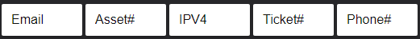
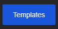

# Tauri-tickets

A project showcasing how to use tauri - svelte - sqlite by creating a ticket/note management app!

# Installing

homebrew:
```bash
brew tap daniel-le97/homebrew-ledevopportunities
brew install --cask tauri-tickets
```
note: for windows the .msi installer works better than the .exe

at the moment the best way to try it out is by checking this repo's Releases:

[Releases](https://github.com/daniel-le97/tauri-ticket-manager/releases/tag/v0.6.1)

or from source locally:
Node and Rust are required for this

1. clone this repo
```bash
git clone https://github.com/daniel-le97/tauri-ticket-manager.git
cd tauri-ticket-manager
```

2. install client deps
```bash
pnpm ingithub

```

3. run the app
```bash
// this will build the client and run the rust (tauri) backend
pnpm run dev
```


This template should help get you started developing with Tauri, Svelte and TypeScript in Vite.

## Recommended IDE Setup

[VS Code](https://code.visualstudio.com/) + [Svelte](https://marketplace.visualstudio.com/items?itemName=svelte.svelte-vscode) + [Tauri](https://marketplace.visualstudio.com/items?itemName=tauri-apps.tauri-vscode) + [rust-analyzer](https://marketplace.visualstudio.com/items?itemName=rust-lang.rust-analyzer).

# Basic Usage


https://github.com/daniel-le97/tauri-ticket-manager/assets/107774403/c53f8d6a-5296-4505-96f9-f31dc7286156


MyNoteTaker is a simple and intuitive note-taking application. Follow these steps to get started:

1. Start Documenting the Ticket | Call, The Timer will Begin
   

2. Copying any Email, Phone Number, Asset# or Ticket# will autofill those input fields
   

3. Once documentation has ended, you can select the Clipboard Icon to copy all the relevant information to your clipboard.
   

# Create a New Note

To create a new note, follow these steps:

1. Click on the Right Chevron
   

2. Notes are automatically saved upon confirming the pop-up message.

3. Note will be recorded by date and a randomly generated ID, which you can view previous tickets by.
   

# Use and Create Templates



1. From the dashboard, you can click on the above button

2. clicking the templates button displays a drawer of all of your templates.

3. click on a template and its contents are copied to your clipboard.

4. paste away!.


# Organize Your templates/snippets

you can organize your templates by:

1. Using tags to group related templates

2. clicking "configure templates" on the dashboard

3. by default this window will allow composing new templates

4. clicking on a template in this view marks it for editing

5. be sure to hit save!

